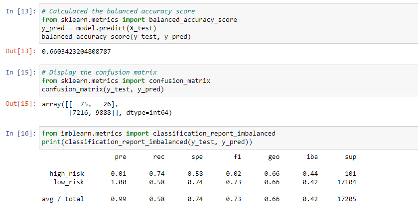
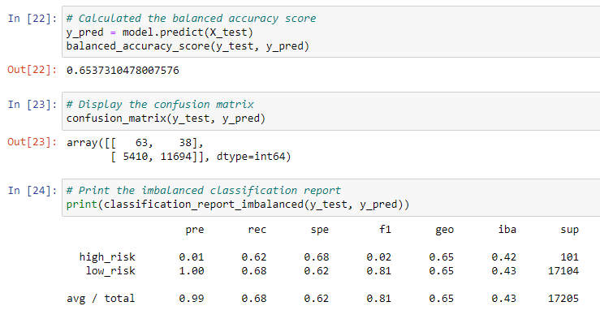
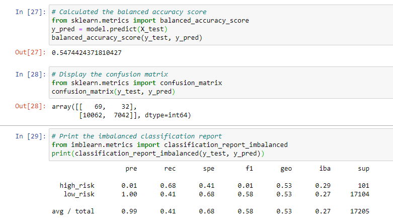
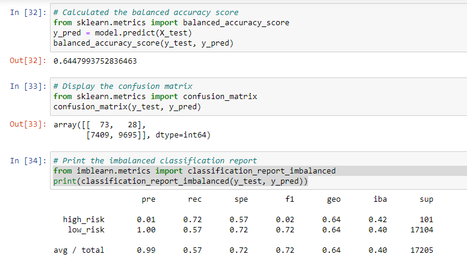
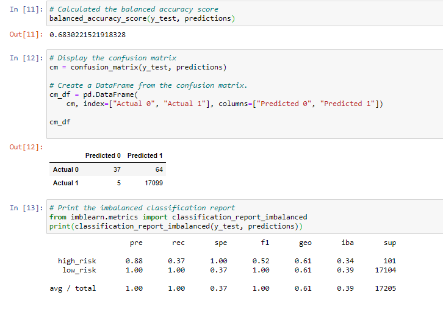
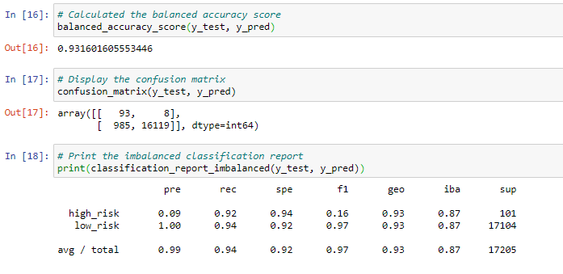
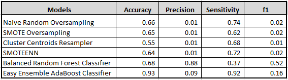

# Credit Risk Analysis

## Overview of the analysis: 
In this module we'll be using the credit card credit dataset from LendingClub, a peer-to-peer lending services company, to predict credit risk using 6 different michine learning models in Python. 

## Results: 
- Naive Random Oversampling - With a 66% accuracy score, a low precison of 1%, a relatively high Sensitivity score of 74% and a low f1 score of .02. This is a more aggressive model, as they do a good job of detecting the intended targets, but also risk resulting in a number of false positives for the high risk loans.

- SMOTE Oversampling - A slightly lower accuracy score of 65%, a low precision score of 1%, a even lower Sensitivity score of 62% and the same f1 score of .02.  

- ClusterCentroids resampler - The worst accuracy score out of all the models at 55%, a low precision score of 1%, a sensitivity score of 68% and a f1 score of .01 f1. 

- SMOTEENN - An accuracy score of 64%, a low precision score of 1%, a 72% sensitivity score and .02 f1 score. So far, all the models are agressive with very low precision scores, resulting in low f1 score.  

- Balanced Random Forest Classifier - a slightly improved accuracy score of 68%, an impressive 88% precision, a low sensitive score of 37% but a pretty good balance f1 score.  This model has potential becuase of it's high precision and a good balance of f1 score. However, the accuracy of only 68%, this model isn't ideal.

- Easy Ensemble AdaBoost Classifier - with an impressive accuracy score of 93%, a low precision score of 9%, the highest sensitivity score of all models at 92%, and a low f1 score of .15. This is the most agressive model we've tested, which can result in too many false positives. 

- Overall Comparison of each model - the image below shows a comparison of all 6 models. The last 2 models clearly has the 2 highest accuracy scores.

## Summary: 
Based on the results highlighted from above, none of the models seems ideal in predicting credit risk. However, the Balanced Random Forest Classifier model seems to have the best balance between precision and sensitivity with a f1 score of 52%.  Although it only has an accuracy rate of 68%, not the highest of all of our models, it does have the highest precision rate of 88%. Hence, this model could be ideal for the type of business we're analyzing. Loans aren't always safe but they could result in high profitibility, we don't want a highly sensitive model because we'll end up rejecting more loans than necessary, which can result in less profitibility. 
